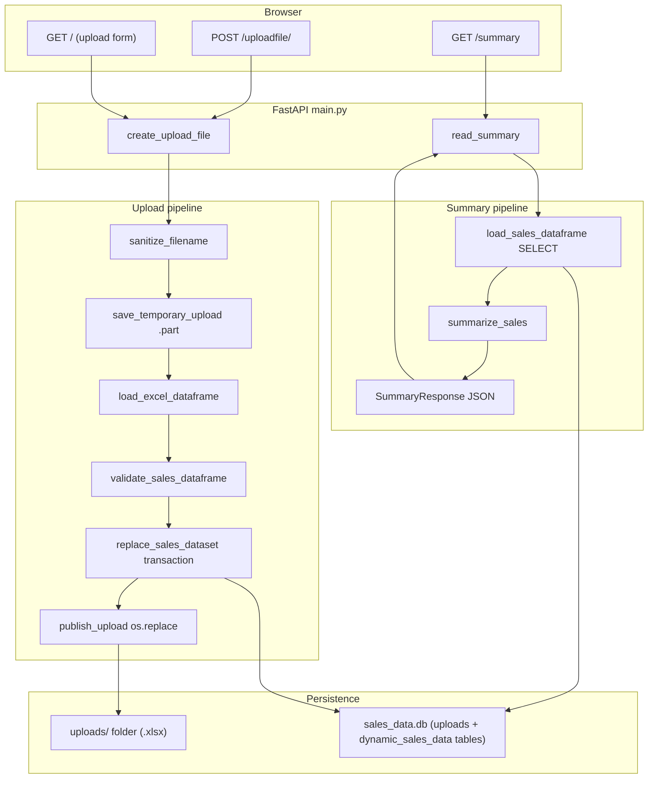

# Financial Report Generator

[](https://github.com/MiroslavKocian/financial-report-generator/actions/workflows/test.yml)

Upload an Excel sales workbook, save each row in a **SQLite** database using **SQL you write in Python** (no ORM), and read a **JSON summary** (`total_amount`, `min_amount`, `max_amount`) from a **FastAPI** app. The upload page is **Jinja2** HTML. Quality checks run with **pytest** (100% coverage on app modules), **Ruff**, **Docker**, and **GitHub Actions**.

**Repository:** https://github.com/MiroslavKocian/financial-report-generator

## What this demo shows

| Topic | Files in git |
|--------|----------------|
| REST API routes | `main.py` |
| Request/response shapes (OpenAPI schema) | `schemas.py` |
| Interactive API docs (Swagger) | Not in git — open [http://127.0.0.1:8000/docs](http://127.0.0.1:8000/docs) while the server runs |
| Raw SQL (no ORM) | `database.py` |
| Safe file upload on disk | `file_manager.py` |
| Excel to pandas | `excel_loader.py` |
| Validation and summary | `analysis.py` |
| CI on every push | `.github/workflows/test.yml` |

Only **one active dataset** exists at a time. A new upload **replaces** the previous Excel file on disk and all previous sales rows in SQLite. Uploading again with the **same filename** is allowed.

## Features

- **Upload** `.xlsx` from [http://127.0.0.1:8000](http://127.0.0.1:8000) or `POST http://127.0.0.1:8000/uploadfile/`
- **Validate before replace** — invalid Excel or bad `amount` values return **400** and do **not** delete the previous dataset
- **Persist data** — SQLite file `sales_data.db`: table **`uploads`** (file metadata) and table **`dynamic_sales_data`** (row data); folder **`uploads/`** on disk holds the active `.xlsx` file
- **Report** — `GET http://127.0.0.1:8000/summary` returns JSON

## Stack

- Python **3.11**
- **FastAPI**, **Uvicorn**, **Jinja2**, **python-multipart**
- **pandas**, **openpyxl**
- **SQLite** — `sales_data.db` is created on app startup (`init_db` in `main.py`)
- **pytest**, **pytest-cov**, **Ruff**

## Architecture

Upload and summary are **two separate HTTP requests**. Parsing and validation run **before** any database replace or final file publish.



| Step | Module | What happens |
|------|--------|----------------|
| Sanitize | `file_manager` | Use only the base filename; reject empty or unsafe names |
| Stage | `file_manager` | Write upload bytes to a temporary `*.part` file under `uploads/` |
| Parse | `excel_loader` | Read `.xlsx`; normalize headers (e.g. `Amount` becomes column `amount`) |
| Validate | `analysis` | Every row must have a numeric `amount` (checked on upload) |
| Replace DB | `database` | One transaction: drop old `dynamic_sales_data`, clear `uploads` table, insert new metadata and rows |
| Publish file | `file_manager` | `os.replace` temp file to final name; delete other files in `uploads/` |
| Report | `analysis` | `row_count`, `total_amount`, `min_amount`, `max_amount` |

If upload fails **before** `replace_sales_dataset` commits, the temp file is deleted and the previous dataset stays unchanged.

## Excel format

- **File type:** `.xlsx` only (read with openpyxl).
- **Required column:** `amount` — any header that normalizes to `amount` (e.g. `Amount`, ` AMOUNT `).
- **Values:** numbers only; missing or non-numeric `amount` returns **400 on upload**.
- **Optional columns:** stored as TEXT (e.g. `region`, `product`).
- **Rules:** at least one data row; no duplicate headers after normalization; headers must be valid SQL column names (letters, digits, underscore). Names `id` and `upload_id` are reserved.

Sample workbook: [`examples/sales_example.xlsx`](examples/sales_example.xlsx).

## API

Base URL when running locally: **http://127.0.0.1:8000**

| Method | URL | Description |
|--------|-----|-------------|
| GET | [http://127.0.0.1:8000/](http://127.0.0.1:8000/) | Upload form (HTML) |
| POST | [http://127.0.0.1:8000/uploadfile/](http://127.0.0.1:8000/uploadfile/) | Upload Excel (`multipart` field name: **`file`**) |
| GET | [http://127.0.0.1:8000/summary](http://127.0.0.1:8000/summary) | JSON sales summary |
| GET | [http://127.0.0.1:8000/docs](http://127.0.0.1:8000/docs) | Swagger UI (try endpoints in the browser) |
| GET | [http://127.0.0.1:8000/redoc](http://127.0.0.1:8000/redoc) | Alternative API docs (same OpenAPI spec) |

FastAPI builds the OpenAPI spec from `main.py` and `schemas.py`; you do not maintain a separate docs file in the repo.

### `POST /uploadfile/` — success **200**

```json
{
  "filename": "sales.xlsx",
  "file_id": 1,
  "rows_stored": 3,
  "status": "File uploaded and raw data stored via raw SQL"
}
```

**400** — invalid workbook, missing/invalid `amount`, reserved columns, unsafe filename, and similar validation errors.

**500** — disk or database error; the HTTP body is generic (`Check the server log`); details are in the server log.

### `GET /summary` — success **200**

```json
{
  "row_count": 3,
  "total_amount": 40.0,
  "min_amount": 5.0,
  "max_amount": 25.0
}
```

**400** — no sales data stored yet (upload a file first).

## Prerequisites

- **Python 3.11** — https://www.python.org/downloads/
- **Git** — to clone the repository
- **Docker Desktop** — only if you use the Docker section below  
  https://www.docker.com/products/docker-desktop/
- **Windows PowerShell:** if `Activate.ps1` is blocked, run once:  
  `Set-ExecutionPolicy -Scope CurrentUser RemoteSigned`

## Run locally

### 1. Clone and enter the project

```sh
git clone https://github.com/MiroslavKocian/financial-report-generator.git
cd financial-report-generator
```

### 2. Virtual environment and dependencies

Windows (PowerShell):

```powershell
python -m venv .venv
.\.venv\Scripts\Activate.ps1
pip install -r requirements.txt
```

macOS / Linux:

```bash
python3 -m venv .venv
source .venv/bin/activate
pip install -r requirements.txt
```

### 3. Start the server

```sh
python main.py
```

This starts Uvicorn on port **8000** with reload enabled (see `main.py`).

Open [http://127.0.0.1:8000](http://127.0.0.1:8000).

- First start creates **`sales_data.db`** in the project folder.
- The **`uploads/`** folder is created when you upload a file.

### 4. Upload and summary

1. Open [http://127.0.0.1:8000](http://127.0.0.1:8000).
2. Choose `examples/sales_example.xlsx` and click **Upload and Store**.
3. Open [http://127.0.0.1:8000/summary](http://127.0.0.1:8000/summary) and confirm JSON fields `total_amount`, `min_amount`, `max_amount`.

### 5. Tests and lint

With the virtual environment active:

```sh
pytest
ruff check .
ruff format .
```

**GitHub Actions:** each push to GitHub runs the same Ruff and pytest steps automatically (workflow file `.github/workflows/test.yml`). Results appear under the repository **Actions** tab.

## Docker

From the project folder:

```sh
docker compose up --build
```

- Keep the terminal open while you use the app.
- Logs may show `Uvicorn running on http://0.0.0.0:8000` **inside the container**. On your computer use [http://127.0.0.1:8000](http://127.0.0.1:8000) or [http://localhost:8000](http://localhost:8000).
- `compose.yaml` maps host port **8000** to the container and mounts a Docker volume on **`/app/uploads`** (Excel files survive `docker compose down`). **`sales_data.db` stays inside the container** unless you add your own volume for it — after a full recreate, upload the Excel file again.

Repeat **§4 Upload and summary** in the browser. A log line `GET / HTTP/1.1" 200` means the home page loaded.

Stop: **Ctrl+C**, then:

```sh
docker compose down
```

## Project layout

```text
financial-report-generator/
├── main.py                 # FastAPI app, routes, lifespan (init_db)
├── database.py             # SQLite: replace_sales_dataset, load_sales_dataframe
├── file_manager.py         # uploads/ folder: sanitize, temp file, publish
├── excel_loader.py         # pandas read_excel + column normalization
├── analysis.py             # validate_sales_dataframe, summarize_sales
├── schemas.py              # Pydantic UploadResponse, SummaryResponse
├── templates/
│   └── index.html          # Upload UI
├── examples/
│   └── sales_example.xlsx  # Sample workbook
├── tests/                  # pytest (isolated DB and uploads/ per test)
├── .github/workflows/
│   └── test.yml            # GitHub Actions: Ruff + pytest + coverage
├── Dockerfile
├── compose.yaml
├── requirements.txt
├── pyproject.toml          # pytest coverage thresholds, Ruff
├── AGENTS.md               # Contributor conventions
└── README.md
```

**Created at runtime (not in git):** `sales_data.db`, `uploads/` (local run).

## Troubleshooting

| Issue | What to try |
|--------|-------------|
| Port 8000 already in use | Stop the other app on 8000, or run `uvicorn main:app --host 127.0.0.1 --port 8001` and open `http://127.0.0.1:8001` |
| `Activate.ps1` blocked | `Set-ExecutionPolicy -Scope CurrentUser RemoteSigned` |
| Upload returns 400 | Use `.xlsx`, include a column that normalizes to `amount`, numeric values, at least one row |
| Summary returns 400 | Upload a file before opening `/summary` |
| Docker: summary empty after recreate | Database was not on a volume; upload the Excel file again |
| GitHub Actions failed on format | Run `ruff format .` locally, commit, and push |

## Contributing

See [`AGENTS.md`](AGENTS.md): raw SQL only, no Streamlit, English comments in code, small focused changes.

## License

No `LICENSE` file in the repository. The code is shared for portfolio and interview review; do not assume permission to reuse without asking the author.
