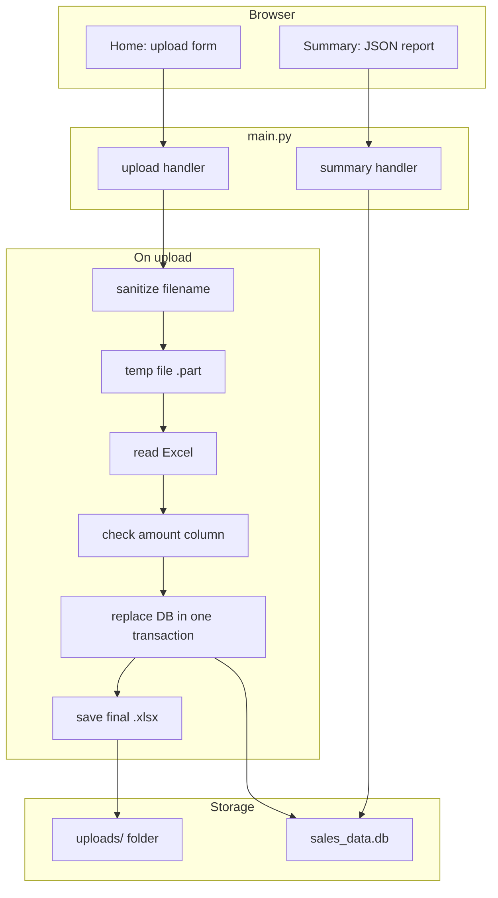

# Financial Report Generator

[](https://github.com/MiroslavKocian/financial-report-generator/actions/workflows/test.yml)

Upload an Excel sales workbook, save rows in **SQLite** with **SQL in Python** (no ORM), and view a **JSON summary** in the browser. Built with **FastAPI**, **pandas**, and a small **Jinja2** upload page.

**Repository:** https://github.com/MiroslavKocian/financial-report-generator

## What this demo shows

| Topic | File in git |
|--------|-------------|
| Web app and routes | `main.py` |
| JSON response models | `schemas.py` |
| Raw SQL (no ORM) | `database.py` |
| Safe file handling | `file_manager.py` |
| Excel import | `excel_loader.py` |
| Validation and totals | `analysis.py` |
| Automated tests on push | `.github/workflows/test.yml` |

One **active dataset** at a time. Each new upload replaces the previous Excel file and all rows in the database. Same filename is allowed.

## Features

- Upload `.xlsx` on the home page
- Invalid files are rejected **before** the old data is deleted
- Data lives in `sales_data.db` (SQLite) and the latest file in the `uploads/` folder
- Summary page shows `total_amount`, `min_amount`, and `max_amount`

## Stack

Python **3.11**, FastAPI, Uvicorn, Jinja2, pandas, openpyxl, SQLite, pytest, Ruff, Docker, GitHub Actions.

## Architecture



| Step | Module |
|------|--------|
| Filename safety, temp file, publish | `file_manager` |
| Read Excel, normalize column names | `excel_loader` |
| Check numeric `amount` | `analysis` |
| SQL insert and replace | `database` |

## Excel format

- `.xlsx` only
- Column **`amount`** required (header can be `Amount`, ` AMOUNT `, and similar)
- Numbers only in `amount`; at least one row
- Extra columns (e.g. `region`) are stored too

Sample: [`examples/sales_example.xlsx`](examples/sales_example.xlsx).

## Pages (server must be running)

| Page | Link |
|------|------|
| Upload form | [http://127.0.0.1:8000](http://127.0.0.1:8000) |
| Summary (JSON) | [http://127.0.0.1:8000/summary](http://127.0.0.1:8000/summary) |
| API reference (FastAPI) | [http://127.0.0.1:8000/docs](http://127.0.0.1:8000/docs) |

The upload form sends the file for you when you click **Upload and Store**. You do not run any upload command in the terminal.

## Prerequisites

- Python 3.11 — https://www.python.org/downloads/
- Git
- Docker Desktop — only for the Docker section — https://www.docker.com/products/docker-desktop/
- Windows: if `Activate.ps1` fails, run once: `Set-ExecutionPolicy -Scope CurrentUser RemoteSigned`

## Run locally

### 1. Clone

```sh
git clone https://github.com/MiroslavKocian/financial-report-generator.git
cd financial-report-generator
```

### 2. Virtual environment

Windows (PowerShell):

```powershell
python -m venv .venv
.\.venv\Scripts\Activate.ps1
pip install -r requirements.txt
```

macOS / Linux:

```bash
python3 -m venv .venv
source .venv/bin/activate
pip install -r requirements.txt
```

### 3. Start server

```sh
python main.py
```

Open [http://127.0.0.1:8000](http://127.0.0.1:8000). The app creates `sales_data.db` on first start.

### 4. Upload and summary

1. On [http://127.0.0.1:8000](http://127.0.0.1:8000), select `examples/sales_example.xlsx` and click **Upload and Store**.
2. Open [http://127.0.0.1:8000/summary](http://127.0.0.1:8000/summary).

### 5. Tests

```sh
pytest
ruff check .
ruff format .
```

Pushes to GitHub run the same checks in the **Actions** tab.

## Docker

```sh
docker compose up --build
```

Open [http://127.0.0.1:8000](http://127.0.0.1:8000) and do steps **4** above. Container logs may show `0.0.0.0:8000`; use `127.0.0.1:8000` in the browser.

Stop with **Ctrl+C**, then `docker compose down`.

## Project layout

```text
main.py              FastAPI app
database.py          SQLite SQL
file_manager.py      uploads/ folder
excel_loader.py      Excel import
analysis.py          validation and summary
schemas.py           API models
templates/index.html upload page
examples/            sample Excel
tests/               pytest
.github/workflows/   CI
Dockerfile
compose.yaml
requirements.txt
pyproject.toml
AGENTS.md
```

Runtime files (not in git): `sales_data.db`, `uploads/`.

## Troubleshooting

| Problem | Fix |
|---------|-----|
| Port 8000 busy | Close the other program using port 8000 |
| `Activate.ps1` blocked | `Set-ExecutionPolicy -Scope CurrentUser RemoteSigned` |
| Upload fails | `.xlsx`, `amount` column, numeric values, at least one row |
| Summary empty | Upload a file first |
| Docker: no data after restart | Upload the Excel file again |

## Contributing

See [`AGENTS.md`](AGENTS.md).

## License

Portfolio and interview use; no `LICENSE` file unless one is added later.
