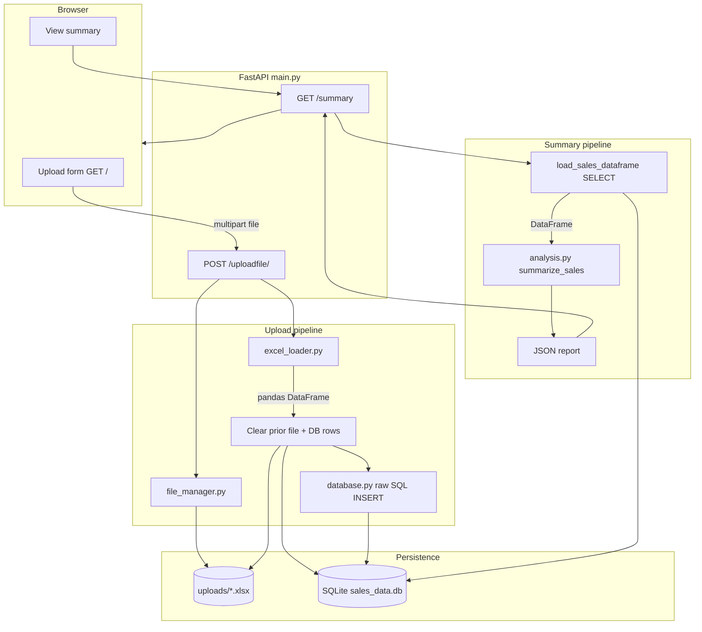

# Financial Report Generator

[](https://github.com/MiroslavKocian/financial-report-generator/actions/workflows/test.yml)

Upload an Excel sales file, store rows in **SQLite** with **raw SQL**, and generate a **pandas** summary report over **FastAPI**. The UI uses **Jinja2**; the stack includes **Docker** and **GitHub Actions** CI.

## Features

- **Upload** `.xlsx` files with sanitized filenames and a single active dataset on disk and in the database
- **Persist** each row via parameterized SQL (`uploads` metadata + `dynamic_sales_data`)
- **Report** via `GET /summary`: `total_amount`, `min_amount`, and `max_amount` for the `amount` column

Uploading again with the **same filename** overwrites the file and refreshes stored rows.

## Stack

- **Python 3.11** — FastAPI, Uvicorn, pandas, openpyxl
- **SQLite** — `database.py`
- **HTML** — `templates/index.html`
- **pytest** — coverage on `database`, `file_manager`, `excel_loader`, `analysis`, `main`

## Architecture

One active dataset. Upload and summary are separate requests; the report is JSON from `GET /summary`.



| Stage | Module | What happens |
|-------|--------|----------------|
| Ingest | `file_manager` | Sanitize filename, write bytes to `uploads/` (same name replaces file) |
| Parse | `excel_loader` | Read `.xlsx`, normalize headers (`Amount` → `amount`) |
| Replace | `main` + `database` | After a valid parse: remove old uploads, refresh sales table and metadata |
| Report | `analysis` | Load rows → `total_amount`, `min_amount`, `max_amount` |

If parsing fails before the replace step, the previous dataset remains in place.

## Excel format

- File type: **`.xlsx`** (openpyxl).
- Required column: **`amount`** (headers normalized, e.g. `Amount` → `amount`). Numeric values only.
- Additional columns (e.g. `region`) are stored with each row.
- Duplicate headers after normalization are rejected.

## API

### `GET /`

Upload form and link to the summary.

### `POST /uploadfile/`

`multipart/form-data` field: `file`.

**200 example:**

```json
{
  "filename": "sales.xlsx",
  "file_id": 1,
  "rows_stored": 3,
  "status": "File uploaded and raw data stored via raw SQL"
}
```

**400** — invalid Excel, missing `amount`, unsafe filename, etc.

### `GET /summary`

**200 example:**

```json
{
  "row_count": 3,
  "total_amount": 40.0,
  "min_amount": 5.0,
  "max_amount": 25.0
}
```

**400** — no data stored yet.

OpenAPI UI: [http://127.0.0.1:8000/docs](http://127.0.0.1:8000/docs) while the server is running.

## Run locally

```powershell
cd financial-report-generator
python -m venv .venv
.\.venv\Scripts\Activate.ps1
pip install -r requirements.txt
python main.py
```

Open [http://127.0.0.1:8000](http://127.0.0.1:8000).  
`main.py` runs Uvicorn with `reload=True` for development.

### Tests

```powershell
pytest
```

### CI

Every **push** and **pull request** runs `pytest` (`.github/workflows/test.yml`).

### Lint

```powershell
ruff check .
```

## Docker

```powershell
docker build -t financial-report-generator .
docker run --rm -p 8000:8000 financial-report-generator
```

## Project layout

```text
main.py           # FastAPI routes and upload pipeline
database.py       # SQLite schema, inserts, load_sales_dataframe()
excel_loader.py   # Read Excel, normalize column names
analysis.py       # summarize_sales() — total / min / max
file_manager.py   # uploads/ directory, sanitize, replace on same name
templates/        # Upload UI
tests/            # pytest suite
AGENTS.md         # Contributor and agent conventions
```
