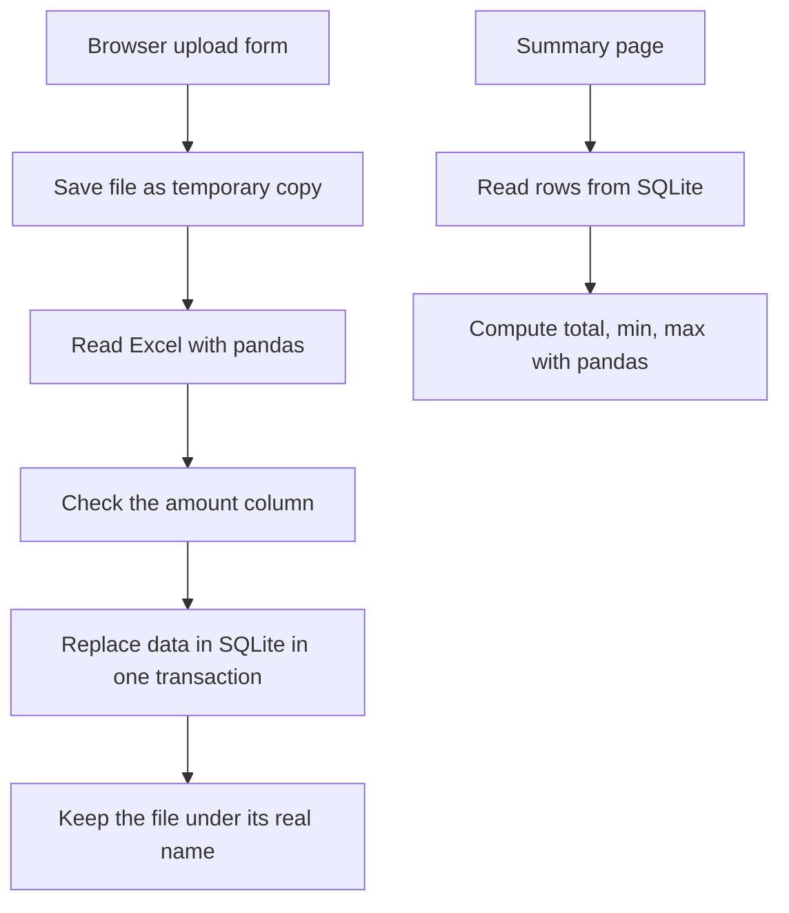

# Financial Report Generator

[](https://github.com/MiroslavKocian/financial-report-generator/actions/workflows/test.yml)

A small web app: you upload an Excel file with sales data, the app saves every row into a SQLite database, and a summary page shows the total, minimum, and maximum `amount`.

Built with Python 3.11, FastAPI, pandas, and SQLite. All database queries are plain SQL written by hand (no ORM).

## Requirements

- [Python 3.11](https://www.python.org/downloads/)
- [Git](https://git-scm.com/downloads)
- [Docker Desktop](https://www.docker.com/products/docker-desktop/) (only if you want to run the app in Docker)

## Run locally

### 1. Download the project

```sh
git clone https://github.com/MiroslavKocian/financial-report-generator.git
cd financial-report-generator
```

This creates a folder named `financial-report-generator`. Run every following command inside this folder.

### 2. Install dependencies

Windows (PowerShell):

```powershell
python -m venv .venv
.\.venv\Scripts\Activate.ps1
pip install -r requirements.txt
```

macOS / Linux:

```bash
python3 -m venv .venv
source .venv/bin/activate
pip install -r requirements.txt
```

If PowerShell refuses to run `Activate.ps1`, run this once and try again:

```powershell
Set-ExecutionPolicy -Scope CurrentUser RemoteSigned
```

### 3. Start the app

```sh
python main.py
```

Keep this terminal window open. The app runs as long as it is open. To stop it, press **Ctrl+C**.

### 4. Use the app

1. Open [http://127.0.0.1:8000](http://127.0.0.1:8000) in your browser.
2. Under **Select Excel file**, click the file button and pick the sample file `sales_example.xlsx`. It is in the `examples` folder inside the project folder you downloaded in step 1.
3. Click **Upload and Store**. The browser shows a short confirmation, for example:

   ```json
   {"filename": "sales_example.xlsx", "file_id": 1, "rows_stored": 2, "status": "File uploaded and raw data stored via raw SQL"}
   ```

4. Open [http://127.0.0.1:8000/summary](http://127.0.0.1:8000/summary). For the sample file you will see:

   ```json
   {"row_count": 2, "total_amount": 35.0, "min_amount": 10.0, "max_amount": 25.0}
   ```

Every new upload replaces the previous data. Uploading a file with the same name again is allowed.

FastAPI also generates an interactive API page at [http://127.0.0.1:8000/docs](http://127.0.0.1:8000/docs), where you can see and try every endpoint.

## Run with Docker

Start Docker Desktop, then in the project folder run:

```sh
docker compose up --build
```

When the log shows `Application startup complete`, follow the steps in [Use the app](#4-use-the-app). The log says `http://0.0.0.0:8000`; that is the address inside the container. In your browser, use [http://127.0.0.1:8000](http://127.0.0.1:8000).

To stop, press **Ctrl+C**, then run:

```sh
docker compose down
```

The database lives inside the container, so after `docker compose down` the data is gone. Upload the file again after the next start.

## Excel file rules

- The file must be `.xlsx`.
- It must have a column named `amount`. Capital letters and extra spaces in the header are fine (`Amount`, ` AMOUNT `).
- Every `amount` cell must be a number, and the file must have at least one data row.
- Other columns (for example `region`, `product`) are saved too.
- Column names may contain only letters, digits, and underscores (spaces become underscores). `id` and `upload_id` are not allowed as column names.

If a file breaks a rule, the app shows an error message and keeps the previously uploaded data.

## How it works



1. The uploaded file is first saved as a temporary copy.
2. pandas reads it and the `amount` column is checked.
3. Only if everything is valid, the old data is replaced with the new rows in a single database transaction. If anything fails, the old data stays untouched.
4. The summary page reads the rows back from SQLite and computes the numbers.

| File | Responsibility |
|------|----------------|
| `main.py` | Web routes and the upload flow |
| `file_manager.py` | Safe file names, temporary file, final file |
| `excel_loader.py` | Reading Excel and cleaning up column names |
| `analysis.py` | Checking `amount` and computing the summary |
| `database.py` | All SQL queries |
| `schemas.py` | Shape of the JSON responses |
| `templates/index.html` | Upload page |

Files created while the app runs (not stored in Git): `sales_data.db` (the database) and the `uploads` folder (the latest uploaded Excel file). Both appear in the project folder.

## Tests

With the virtual environment active:

```sh
pytest
ruff check .
ruff format --check .
```

`pytest` runs all tests and requires 100% code coverage. `ruff` checks code style.

GitHub runs the same three commands automatically after every push (file `.github/workflows/test.yml`). The green **Tests** badge at the top of this page shows the latest result.

## Project structure

```text
financial-report-generator/
├── main.py
├── database.py
├── file_manager.py
├── excel_loader.py
├── analysis.py
├── schemas.py
├── templates/
│   └── index.html
├── examples/
│   └── sales_example.xlsx
├── tests/
├── .github/workflows/test.yml
├── Dockerfile
├── compose.yaml
├── requirements.txt
├── pyproject.toml
└── AGENTS.md
```

`pyproject.toml` holds the pytest and Ruff settings. `AGENTS.md` holds the coding rules followed while building this project.

## Troubleshooting

| Problem | Solution |
|---------|----------|
| Browser says the page cannot be reached | The app is not running. Start it with `python main.py` and keep the terminal open. |
| `Address already in use` / port 8000 busy | Another app (or a second copy of this one) is using port 8000. Close it and start again. |
| Summary shows `No sales data is stored.` | Nothing has been uploaded yet. Upload a file first. |
| Upload shows an error | The file breaks one of the [Excel file rules](#excel-file-rules). The message says which one. |

## License

No license is granted. The code is published to be viewed as a portfolio project.
