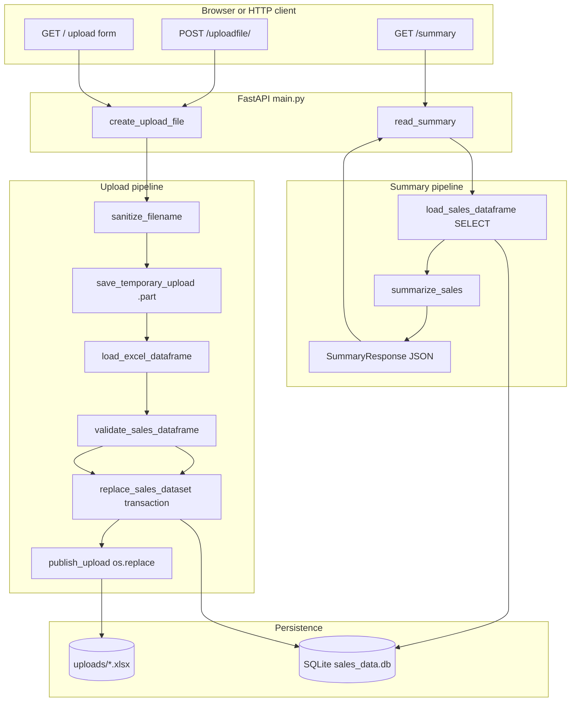

# Financial Report Generator

[](https://github.com/MiroslavKocian/financial-report-generator/actions/workflows/test.yml)

Upload an Excel sales workbook, persist rows in **SQLite** with **hand-written SQL**, and read a **JSON summary** (`total_amount`, `min_amount`, `max_amount`) from **FastAPI**. The browser UI is a small **Jinja2** page; the project ships with **pytest** (100% coverage on core modules), **Ruff**, **Docker**, and **GitHub Actions**.

## What this demo shows

| Topic | Where in the repo |
|--------|-------------------|
| REST API + OpenAPI | `main.py`, `/docs` |
| Raw SQL (no ORM) | `database.py` |
| File upload safety | `file_manager.py` (`basename`, temp file, atomic publish) |
| Excel to pandas | `excel_loader.py` |
| Validation + reporting | `analysis.py` |
| Typed API responses | `schemas.py` |
| Automated quality gate | `.github/workflows/test.yml` |

Only **one active dataset** exists at a time. A new upload **replaces** the previous file on disk and the previous rows in SQLite. Re-uploading the **same filename** is allowed.

## Features

- **Upload** `.xlsx` via the web form or `POST /uploadfile/`
- **Validate** before replace: bad Excel or missing numeric `amount` never wipes good data
- **Store** metadata in `uploads` and row data in `dynamic_sales_data` (column layout follows the workbook)
- **Report** via `GET /summary` as JSON

## Stack

- Python **3.11**
- **FastAPI**, **Uvicorn**, **Jinja2**, **python-multipart**
- **pandas**, **openpyxl**
- **SQLite** (`sales_data.db`, created on startup)
- **pytest**, **pytest-cov**, **Ruff**

## Architecture

Upload and summary are separate HTTP requests. The upload path parses and validates **before** any destructive step.



| Step | Module | Responsibility |
|------|--------|----------------|
| Sanitize | `file_manager` | Strip path segments; reject empty names |
| Stage | `file_manager` | Write bytes to a `.part` file under `uploads/` |
| Parse | `excel_loader` | Read `.xlsx`; normalize headers (e.g. `Amount` to `amount`) |
| Validate | `analysis` | Require numeric `amount` on every row |
| Replace DB | `database` | Single transaction: drop old table, new `uploads` row, insert rows |
| Publish file | `file_manager` | `os.replace` to final name; delete other files in `uploads/` |
| Report | `analysis` | `total_amount`, `min_amount`, `max_amount`, `row_count` |

If anything fails **before** `replace_sales_dataset` succeeds, the temp file is removed and the previous dataset stays intact.

## Excel format

- **Type:** `.xlsx` only (openpyxl).
- **Required column:** `amount` (any header that normalizes to `amount`, e.g. `Amount`, ` AMOUNT `).
- **Values:** numeric; empty `amount` cells are rejected at summary time.
- **Extra columns:** stored as TEXT (e.g. `region`, `product`).
- **Rules:** at least one data row; no duplicate headers after normalization; column names must be valid SQL identifiers (letters, digits, underscore).

Sample file: [`examples/sales_example.xlsx`](examples/sales_example.xlsx).

## API

Interactive docs while the server runs: [http://127.0.0.1:8000/docs](http://127.0.0.1:8000/docs).

### `GET /`

HTML upload form, link to `/summary` and `/docs`.

### `POST /uploadfile/`

`multipart/form-data` field name: **`file`**.

**200 example:**

```json
{
  "filename": "sales.xlsx",
  "file_id": 1,
  "rows_stored": 3,
  "status": "File uploaded and raw data stored via raw SQL"
}
```

**400** — invalid workbook, missing/invalid `amount`, reserved column names (`id`, `upload_id`), unsafe filename, etc.

**500** — disk or database failure (detail is generic; see server logs).

### `GET /summary`

**200 example:**

```json
{
  "row_count": 3,
  "total_amount": 40.0,
  "min_amount": 5.0,
  "max_amount": 25.0
}
```

**400** — no data stored yet.

## Prerequisites

- **Python 3.11** ([python.org](https://www.python.org/downloads/)) or Docker Desktop
- **Git** (to clone)
- On Windows PowerShell: if `Activate.ps1` is blocked, run  
  `Set-ExecutionPolicy -Scope CurrentUser RemoteSigned` once

## Run locally

### 1. Clone and enter the project

```sh
git clone https://github.com/MiroslavKocian/financial-report-generator.git
cd financial-report-generator
```

### 2. Virtual environment and dependencies

Windows (PowerShell):

```powershell
python -m venv .venv
.\.venv\Scripts\Activate.ps1
pip install -r requirements.txt
```

macOS / Linux:

```bash
python3 -m venv .venv
source .venv/bin/activate
pip install -r requirements.txt
```

### 3. Start the server

```sh
python main.py
```

Open [http://127.0.0.1:8000](http://127.0.0.1:8000). On first start the app creates `sales_data.db`; `uploads/` appears when you upload a file.

### 4. Upload and summary

1. Open [http://127.0.0.1:8000](http://127.0.0.1:8000).
2. Select `examples/sales_example.xlsx` and click **Upload and Store**.
3. Open [http://127.0.0.1:8000/summary](http://127.0.0.1:8000/summary) and check JSON (`total_amount`, `min_amount`, `max_amount`).

### 5. Tests and lint

```sh
pytest
ruff check .
ruff format .
```

CI runs the same checks on every push and pull request (see `.github/workflows/test.yml`).

## Docker

Install [Docker Desktop](https://www.docker.com/products/docker-desktop/) (or Docker Engine on Linux), then from the project folder:

```sh
docker compose up --build
```

Open [http://127.0.0.1:8000](http://127.0.0.1:8000) and repeat steps **4. Upload and summary** above. Stop the stack with `docker compose down`.

## Project layout

```text
financial-report-generator/
├── main.py                 # FastAPI app, routes, lifespan (init_db)
├── database.py             # SQLite: replace_sales_dataset, load_sales_dataframe
├── file_manager.py         # uploads/: sanitize, temp save, publish
├── excel_loader.py         # pandas read_excel + column normalization
├── analysis.py             # validate_sales_dataframe, summarize_sales
├── schemas.py              # Pydantic UploadResponse, SummaryResponse
├── templates/
│   └── index.html          # Upload UI
├── examples/
│   └── sales_example.xlsx  # Sample workbook for demos
├── tests/                  # pytest suite (isolated DB/uploads per test)
├── .github/workflows/
│   └── test.yml            # Ruff + pytest + coverage
├── Dockerfile
├── compose.yaml
├── requirements.txt
├── pyproject.toml          # pytest coverage, Ruff line length
├── AGENTS.md               # Design and contribution rules for humans/agents
└── README.md
```

Generated at runtime (gitignored): `sales_data.db`, `uploads/`.

## Troubleshooting

| Issue | What to try |
|--------|-------------|
| Port 8000 in use | Stop the other process or use `--port 8001` with Uvicorn |
| `Activate.ps1` blocked | `Set-ExecutionPolicy -Scope CurrentUser RemoteSigned` |
| Upload 400 | Ensure `.xlsx`, header normalizes to `amount`, numeric values, ≥1 row |
| Summary 400 after fresh install | Upload a file first |
| Docker: empty summary after restart | DB was ephemeral; upload again or mount DB path |
| CI fails on format | Run `ruff format .` locally and commit |

## Contributing

Follow [`AGENTS.md`](AGENTS.md): raw SQL only, no Streamlit, English comments, small focused changes, fail fast with logging on I/O errors.

## License

No license file is set yet; treat the repository as source for portfolio and interview discussion unless a `LICENSE` is added.
