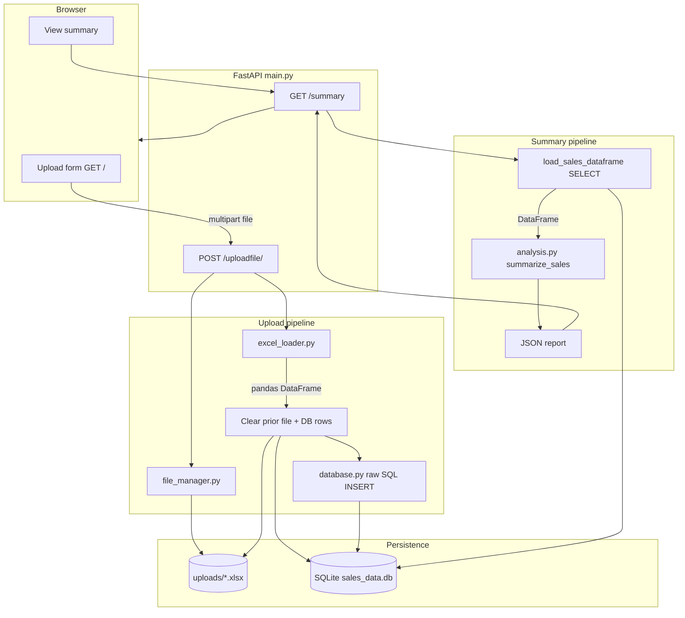

# Financial Report Generator

[](https://github.com/MiroslavKocian/financial-report-generator/actions/workflows/test.yml)

A small **educational** web app: upload one Excel sales file, store rows in **SQLite with raw SQL**, and read a **pandas** summary over HTTP. Built with **FastAPI**, **Jinja2**, and **Docker** — no ORM, no paid APIs.

## What it does

| Step | Status | Description |
|------|--------|-------------|
| 1–2 | Done | Upload `.xlsx`, sanitize filename, replace previous dataset, persist to disk + DB |
| 3 | Done | `GET /summary` — total, min, and max of the `amount` column |
| 4–6 | Out of scope | LLM narrative, PDF export, dashboards (see [Scope](#scope)) |

**One active dataset:** a successful upload clears older files (except the new one on disk) and all prior DB rows. Uploading again with the **same filename** overwrites the file and refreshes the data.

## Stack

- **Python 3.11** — FastAPI, Uvicorn, pandas, openpyxl
- **SQLite** — hand-written SQL only (`database.py`)
- **HTML** — simple upload form (`templates/index.html`)
- **pytest** — 100% coverage on app modules (`pyproject.toml`)

## Architecture

The app keeps **one active dataset**. Upload and summary are separate HTTP requests; the
“report” today is a **JSON summary** (`total`, `min`, `max` on `amount`), not a PDF.



| Stage | Module | What happens |
|-------|--------|----------------|
| Ingest | `file_manager` | Sanitize filename, write bytes to `uploads/` (same name replaces file) |
| Parse | `excel_loader` | Read `.xlsx`, normalize headers (`Amount` → `amount`) |
| Replace | `main` + `database` | On valid parse only: remove old uploads, `DROP` sales data, new `uploads` row + rows in `dynamic_sales_data` |
| Report | `analysis` | `SELECT` active rows → `total_amount`, `min_amount`, `max_amount` |

If Excel parsing fails **before** the replace step, the previous dataset on disk and in SQLite is left unchanged.

## Excel format

- File type: **`.xlsx`** (read via openpyxl).
- Required column: **`amount`** (header is normalized, e.g. `Amount` → `amount`). Values must be numeric.
- Other columns (e.g. `region`) are stored but not used in the summary.
- Duplicate headers after normalization are rejected.

## API

### `GET /`

HTML upload form and link to the summary.

### `POST /uploadfile/`

`multipart/form-data` field: `file`.

**200 example:**

```json
{
  "filename": "sales.xlsx",
  "file_id": 1,
  "rows_stored": 3,
  "status": "File uploaded and raw data stored via raw SQL"
}
```

**400** — invalid Excel, missing `amount`, unsafe filename, etc.

### `GET /summary`

**200 example** (after a successful upload):

```json
{
  "row_count": 3,
  "total_amount": 40.0,
  "min_amount": 5.0,
  "max_amount": 25.0
}
```

**400** — no data stored yet.

Interactive docs: [http://127.0.0.1:8000/docs](http://127.0.0.1:8000/docs) when the server is running.

## Run locally

```powershell
cd financial-report-generator
python -m venv .venv
.\.venv\Scripts\Activate.ps1
pip install -r requirements.txt
python main.py
```

Open [http://127.0.0.1:8000](http://127.0.0.1:8000).  
`main.py` uses `reload=True` for local development.

### Tests

```powershell
pytest
```

Coverage is configured for `database`, `file_manager`, `excel_loader`, `analysis`, and `main`.

### CI

On every **push** and **pull request**, GitHub Actions runs `pytest` (see `.github/workflows/test.yml`).

### Lint (line length)

```powershell
ruff check .
```

## Docker

```powershell
docker build -t financial-report-generator .
docker run --rm -p 8000:8000 financial-report-generator
```

Uploaded files and `sales_data.db` live inside the container unless you mount volumes; for learning, local runs are usually enough.

## Project layout

```text
main.py           # FastAPI routes and upload pipeline
database.py       # SQLite schema, inserts, load_sales_dataframe()
excel_loader.py   # Read Excel, normalize column names
analysis.py       # summarize_sales() — total / min / max
file_manager.py   # uploads/ directory, sanitize, replace on same name
templates/        # Upload UI
tests/            # pytest suite
AGENTS.md         # Conventions for contributors and AI agents
```

## Scope

This repo is intentionally small:

- **In:** REST API, raw SQL, pandas basics, file safety, tests, Docker.
- **Out:** LLM-generated reports, PDF layout, charts, multi-tenant auth, production hardening.

That keeps the project easy to explain in an interview and avoids edge cases that need product rules (period logic, anomalies, percent change, etc.).

## License

Educational / portfolio use. Add a license file if you publish the repo publicly.
