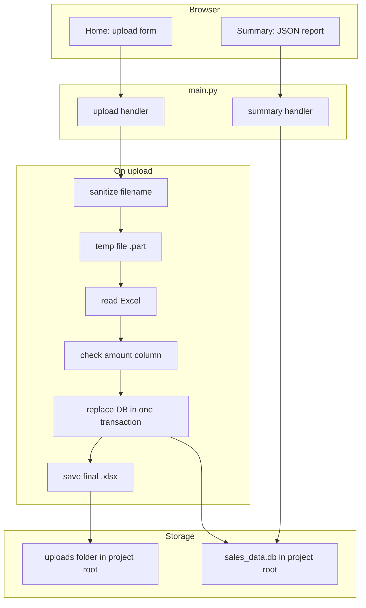

# Financial Report Generator

[](https://github.com/MiroslavKocian/financial-report-generator/actions/workflows/test.yml)

Upload an Excel sales workbook, save rows in **SQLite** with **SQL in Python** (no ORM), and view a **JSON summary** in the browser. Built with **FastAPI**, **pandas**, and a small **Jinja2** upload page.

**Repository:** https://github.com/MiroslavKocian/financial-report-generator

## Project folder (after clone)

All paths below are relative to the folder you get after:

```sh
git clone https://github.com/MiroslavKocian/financial-report-generator.git
cd financial-report-generator
```

That folder is the **project root**. Example on Windows if you cloned to the Desktop:

`C:\Users\<YourName>\Desktop\financial-report-generator`

The sample Excel file is **on your disk** (not a web address):

`financial-report-generator\examples\sales_example.xlsx`

(in the project root, open the `examples` folder, file name `sales_example.xlsx`).

## What this demo shows

| Topic | File in git (under project root) |
|--------|----------------------------------|
| Web app and routes | `main.py` |
| JSON response models | `schemas.py` |
| Raw SQL (no ORM) | `database.py` |
| Safe file handling | `file_manager.py` |
| Excel import | `excel_loader.py` |
| Validation and totals | `analysis.py` |
| Automated tests on push | `.github/workflows/test.yml` |

One **active dataset** at a time. Each new upload replaces the previous Excel file and all rows in the database. Same filename is allowed.

## Features

- Upload `.xlsx` using the form on the home page (file picker on your computer)
- Invalid files are rejected **before** the old data is deleted
- Database file `sales_data.db` appears in the **project root** when the server starts
- Uploaded Excel is stored in the `uploads` folder under the **project root**
- Summary page shows `total_amount`, `min_amount`, and `max_amount`

## Stack

Python **3.11**, FastAPI, Uvicorn, Jinja2, pandas, openpyxl, SQLite, pytest, Ruff, Docker, GitHub Actions.

## Architecture



| Step | Module |
|------|--------|
| Filename safety, temp file, publish | `file_manager` |
| Read Excel, normalize column names | `excel_loader` |
| Check numeric `amount` | `analysis` |
| SQL insert and replace | `database` |

## Excel format

- `.xlsx` only
- Column **`amount`** required (header can be `Amount`, ` AMOUNT `, and similar)
- Numbers only in `amount`; at least one row
- Extra columns (e.g. `region`) are stored too

You can use the included sample file `examples/sales_example.xlsx` or any workbook that follows these rules.

## Pages (start the server first)

Start with `python main.py` from the **project root** (see below). Then use these links in the browser:

| Page | Link |
|------|------|
| Upload form | [http://127.0.0.1:8000](http://127.0.0.1:8000) |
| Summary (JSON) | [http://127.0.0.1:8000/summary](http://127.0.0.1:8000/summary) |
| API reference (FastAPI) | [http://127.0.0.1:8000/docs](http://127.0.0.1:8000/docs) |

On the upload page, click **Select Excel file**, pick a `.xlsx` from your PC, then **Upload and Store**. You never type a file path into the address bar.

## Prerequisites

- Python 3.11 — https://www.python.org/downloads/
- Git
- Docker Desktop — only for the Docker section — https://www.docker.com/products/docker-desktop/
- Windows: if `Activate.ps1` fails, run once: `Set-ExecutionPolicy -Scope CurrentUser RemoteSigned`

## Run locally

### 1. Clone into a folder on your PC

```sh
git clone https://github.com/MiroslavKocian/financial-report-generator.git
cd financial-report-generator
```

Stay in this folder for all following steps.

### 2. Virtual environment

Windows (PowerShell), still in the project root:

```powershell
python -m venv .venv
.\.venv\Scripts\Activate.ps1
pip install -r requirements.txt
```

macOS / Linux:

```bash
python3 -m venv .venv
source .venv/bin/activate
pip install -r requirements.txt
```

### 3. Start server

From the **same project root** folder:

```sh
python main.py
```

Leave this terminal open. Open [http://127.0.0.1:8000](http://127.0.0.1:8000) in your browser.

The file `sales_data.db` is created in the project root on first start.

### 4. Upload and summary

1. In the browser, open [http://127.0.0.1:8000](http://127.0.0.1:8000).
2. Click **Select Excel file** (or **Browse**). In the file dialog, go to your **project root** → open the **`examples`** folder → choose **`sales_example.xlsx`**.
3. Click **Upload and Store**.
4. Open [http://127.0.0.1:8000/summary](http://127.0.0.1:8000/summary) to see the JSON report.

You can upload any other `.xlsx` from your PC that has an `amount` column; the sample is just for a quick test.

### 5. Tests

With the virtual environment active, from the **project root**:

```sh
pytest
ruff check .
ruff format .
```

Pushes to GitHub run the same checks in the repository **Actions** tab on GitHub.

## Docker

From the **project root** on your PC:

```sh
docker compose up --build
```

Leave the terminal open. In the browser use [http://127.0.0.1:8000](http://127.0.0.1:8000) (not `0.0.0.0` from the logs).

For upload, use the same file picker as in step **4**: choose `sales_example.xlsx` from the **`examples`** folder inside the project you cloned on your computer.

Stop with **Ctrl+C**, then:

```sh
docker compose down
```

## Project layout

Everything lives under the project root, for example:

```text
financial-report-generator/
├── main.py
├── database.py
├── file_manager.py
├── excel_loader.py
├── analysis.py
├── schemas.py
├── templates/index.html
├── examples/
│   └── sales_example.xlsx    ← sample file for step 4
├── tests/
├── .github/workflows/test.yml
├── Dockerfile
├── compose.yaml
├── requirements.txt
├── pyproject.toml
└── AGENTS.md
```

After you run the app locally you will also see (not in git):

- `sales_data.db` — in the project root  
- `uploads/` — folder in the project root with the saved Excel file  

## Troubleshooting

| Problem | Fix |
|---------|-----|
| Cannot find sample file | It is not a URL. In the file picker, browse to `examples\sales_example.xlsx` under your clone folder. |
| Port 8000 busy | Close the other program using port 8000, or stop the other `python main.py` terminal. |
| `Activate.ps1` blocked | `Set-ExecutionPolicy -Scope CurrentUser RemoteSigned` |
| Upload fails | `.xlsx`, `amount` column, numeric values, at least one row |
| Summary empty | Complete step 4 (upload) before opening the summary link |
| Docker: no data after restart | Upload the Excel file again from the file picker |

## Contributing

See [`AGENTS.md`](AGENTS.md).

## License

Portfolio and interview use; no `LICENSE` file unless one is added later.
